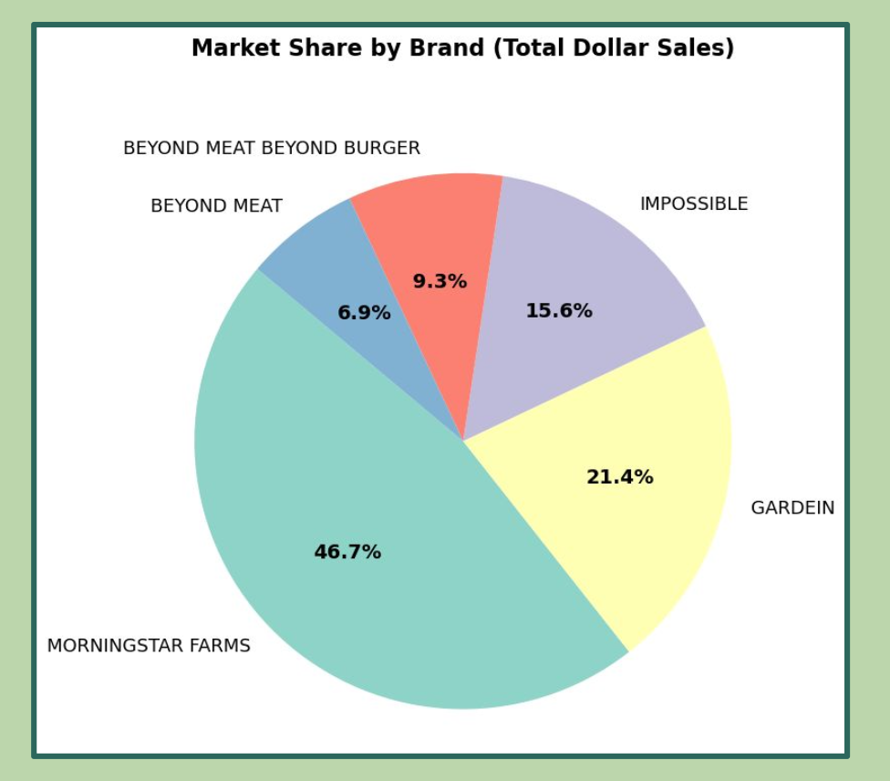
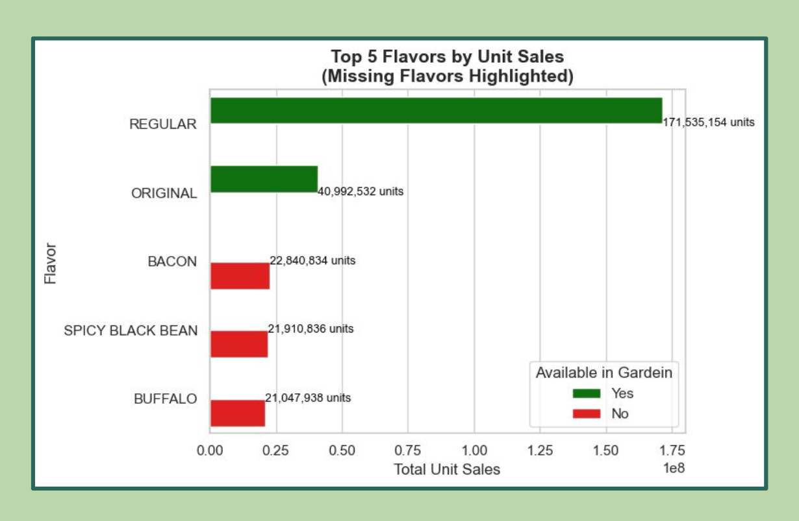
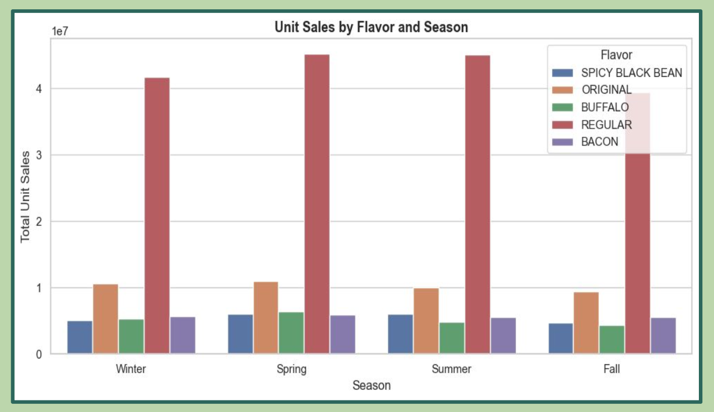
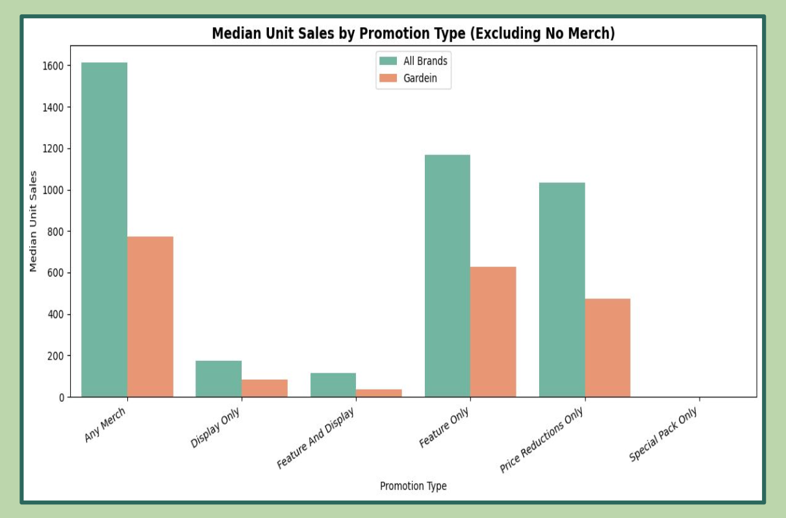
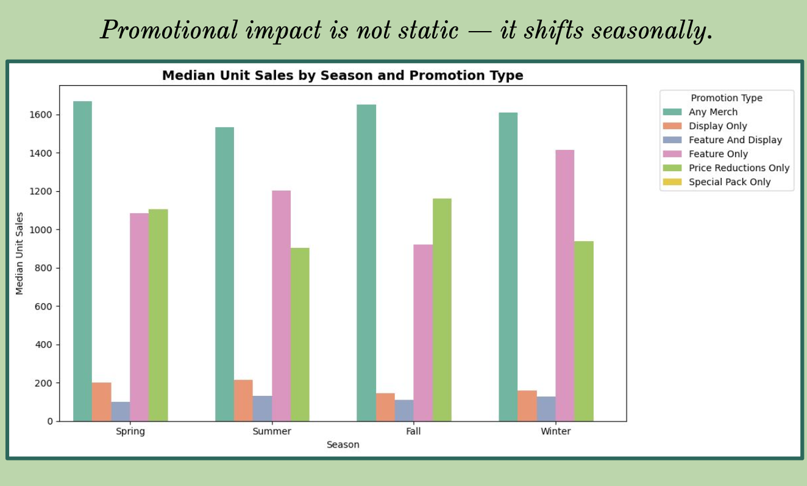
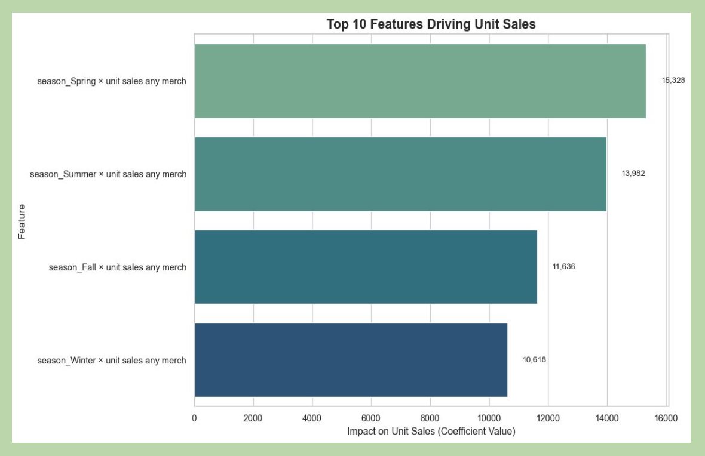

# Turning Taste into Trends: Data-Driven Revival for Conagra (Gardein)

## Overview
This project analyzes the frozen plant-based meat category to identify **what drives unit sales** and how **Gardein (Conagra)** can close the gap versus category leaders. We combine consumer/promotion insights with a **LASSO regression model (with cross-validation)** to quantify the impact of **flavor, seasonality, and merchandising/promotion tactics** on unit sales.

## Problem Context
Gardein is the **#2 brand** in the frozen plant-based meat segment (~**21.4% share**), while **MorningStar Farms** leads with nearly half the market—creating a strategic gap in brand recall, pricing flexibility, and promotion strength.

## Key Questions
1. Which **flavor profiles** drive the highest unit sales?
2. Which **promotional tactics** deliver the strongest sales lift?
3. When are consumers most likely to purchase (seasonality)?
4. How do flavor, promotion, and season **interact** to influence performance?

---

## Quick Preview (Visuals)

  
  

  
  

---

## Data (Not Included)
The original dataset used for this analysis is not included in the repository (course/third-party/proprietary constraints).  
This repo focuses on **documented methodology + outputs** (charts, model interpretation, recommendations).

> Tip: If you later add a small anonymized sample, place it in `data/` as `sample.csv`.

---

## What We Did (Method)

### 1) Market & Consumer Insight Analysis
- Identified top category flavors and gaps in Gardein’s assortment:
  - Top 5 flavors drive **275M+ unit sales**, while Gardein misses **3** of them (**Bacon, Spicy Black Bean, Buffalo**)
- Found seasonal demand spikes (e.g., Spring surge for Original/Bacon) and recommended targeted seasonal promotion strategies.

### 2) Promotion Effectiveness
- Compared performance across promotion types and highlighted underperformance for high-impact tactics (e.g., “Feature Only”, “Any Merch”).
- Observed promotion effectiveness varies by season:
  - Winter/Spring: “Feature & Display” and “Price Reductions Only”
  - Summer: “Feature Only” becomes most effective standalone promotion

### 3) Modeling: LASSO Regression (with cross-validation)
To quantify drivers of unit sales, we built a LASSO model incorporating main effects and interactions:
- Main effects: flavor, season, promotion/merchandising
- Interaction effects:
  - FlavorCluster × Season
  - Season × MerchandiseCondition

**Model Performance**
- Training R²: **0.88**
- Test R²: **0.87**
- Adjusted R²: **0.85**
- Captures ~**85%** of variance in unit sales

---

## Key Visuals (Project Evidence)

### 1) Market Share Snapshot
Shows Gardein’s competitive position and the gap vs the category leader.

  

### 2) Missing Flavor Opportunities
Highlights high-demand flavors/clusters missing or underrepresented in the portfolio.

  

### 3) Seasonal Flavor Trends
Seasonality insights used to recommend timing-based promotions.

  

### 4) Promotion Gap Analysis
Compares promotion tactics and identifies gaps in high-impact tactics.

  

### 5) Season × Promotion Interaction
Demonstrates how promotion effectiveness changes by season and supports strategy alignment.

  

### 6) LASSO Model — Top Features
Key drivers selected by the LASSO model highlighting the most influential factors for unit sales.

  

---

## Key Recommendations (Business Actions)
- Expand or promote high-volume flavors that are missing from the portfolio (Bacon / Spicy Black Bean / Buffalo).
- Align promotion tactics to seasonal responsiveness (Winter/Spring vs Summer differences).
- Improve in-store visibility and merchandising execution in high-impact promotion types where underperformance is observed.

---
