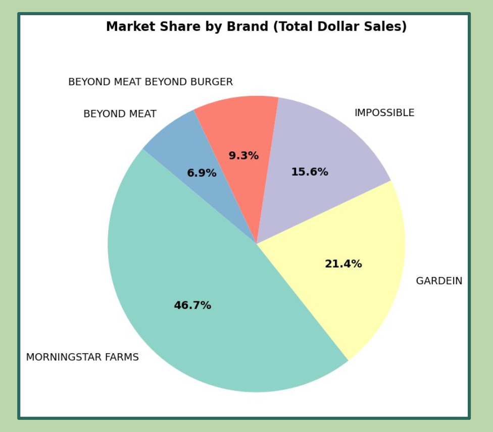
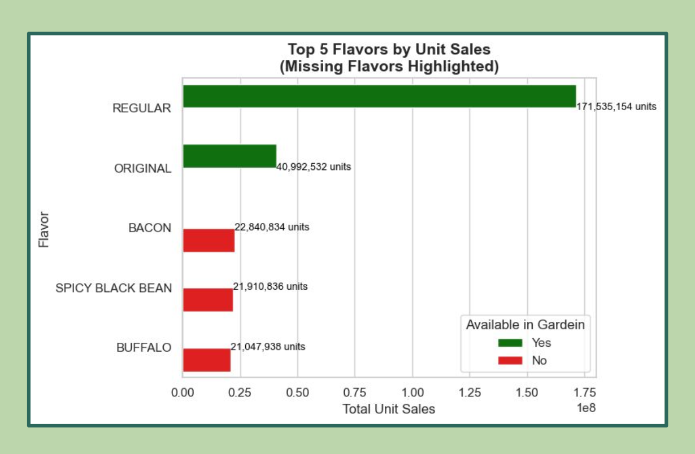
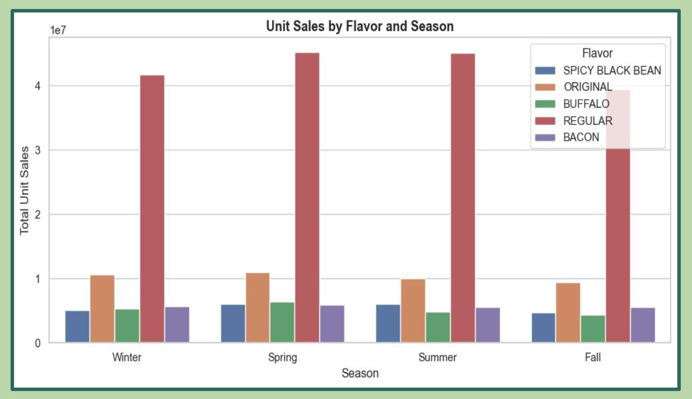
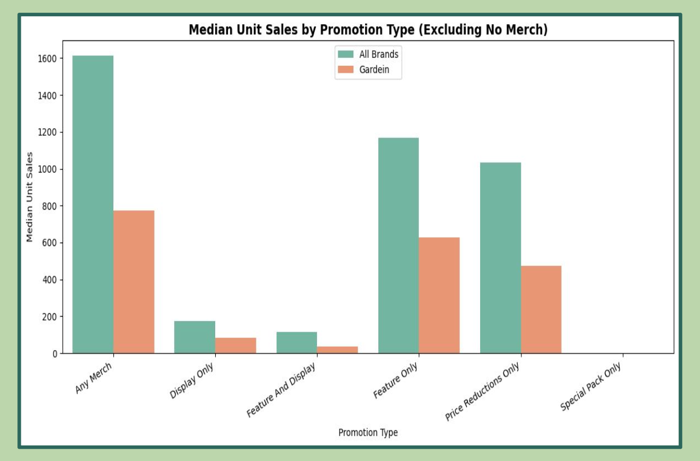
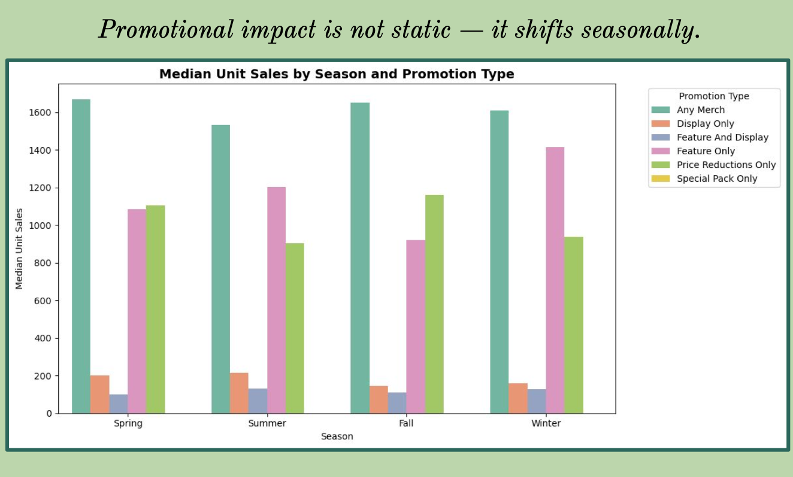
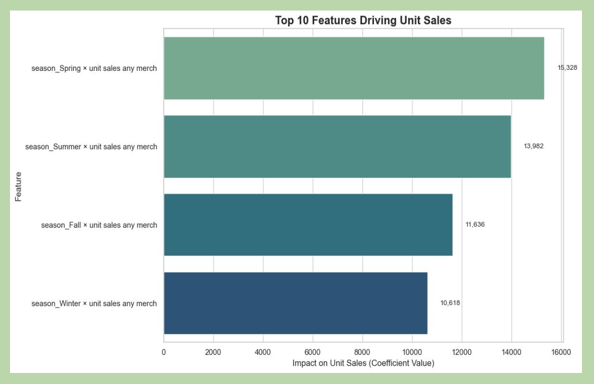

# Turning Taste into Trends: Data-Driven Revival for Conagra (Gardein)

## Overview

This project analyzes the frozen plant-based meat category to identify what drives unit sales and how Gardein, a Conagra brand, can close the performance gap versus category leaders.

The analysis combines market share review, flavor gap analysis, promotion effectiveness, seasonality trends, and LASSO regression modeling to translate raw sales and promotion data into business recommendations.

The project demonstrates an end-to-end data analytics workflow: data preparation, exploratory analysis, feature engineering, statistical modeling, visualization, and business insight storytelling.

---

## Business Problem

Gardein is positioned as the #2 brand in the frozen plant-based meat segment with approximately 21.4% market share, while MorningStar Farms leads with nearly half of the market. This creates a strategic opportunity for Gardein to improve unit sales, strengthen category position, and optimize promotion and flavor strategy.

The goal of this project is to answer:

1. Which flavor profiles drive the highest unit sales?
2. Which promotional tactics deliver the strongest sales lift?
3. How does seasonality affect consumer purchase behavior?
4. How do flavor, season, and merchandising tactics interact to influence unit sales?
5. What actions can Gardein take to improve portfolio performance?

---

## Tools & Technologies

- Python
- Pandas
- NumPy
- Scikit-learn
- Matplotlib / Seaborn
- Jupyter Notebook
- LASSO Regression
- Cross-validation
- Business analysis and data storytelling

---

## Project Structure

```text
assets/      Visual outputs and charts
data/        Synthetic sample dataset
notebooks/   Jupyter notebook with analysis workflow
outputs/     Generated CSV summary outputs
reports/     Final project report
scripts/     Synthetic data generation script
```

---

## Data

The original dataset used for the academic analysis is not included due to course, size, and access restrictions.

This repository includes a synthetic sample dataset:

```text
data/sample_sales_data.csv
```

The synthetic dataset mirrors the structure of the original project dataset and is included to demonstrate the code workflow, analysis logic, and methodology. It is not official Conagra, Gardein, retailer, Nielsen, IRI, or Circana data.

The business findings and model performance shown in the report are based on the original academic analysis. The included synthetic dataset is provided only to demonstrate reproducible code structure and may not reproduce the exact same business metrics.

---

## How to Run

1. Clone the repository.

2. Install the required Python packages:

```bash
pip install -r requirements.txt
```

3. Generate the synthetic sample data and output files:

```bash
python scripts/generate_synthetic_data.py
```

4. Open the Jupyter notebook:

```text
notebooks/conagra_sales_analysis.ipynb
```

5. Review generated output files:

```text
outputs/market_share.csv
outputs/flavor_analysis.csv
```

6. Review the final report:

```text
reports/Predictive Project.pdf
```

---

## Quick Preview

<p align="center">
  
  
</p>

<p align="center">
  
  
</p>

---

## Methodology

### 1. Market and Competitive Analysis

The analysis reviewed brand-level performance to understand Gardein’s competitive position against category leaders.

Key focus areas included:

- Market share comparison by brand
- Unit sales and dollar sales trends
- Category position of Gardein versus MorningStar Farms
- Strategic gap between the #1 and #2 brands

---

### 2. Flavor Gap Analysis

Flavor-level analysis was performed to identify high-demand flavor profiles and opportunities missing from Gardein’s portfolio.

Key finding:

- Top flavor profiles such as Bacon, Spicy Black Bean, and Buffalo represented meaningful category demand, but were missing or underrepresented in Gardein’s portfolio.

Business implication:

- Expanding or promoting high-demand flavor profiles can help Gardein improve relevance, shelf visibility, and category competitiveness.

---

### 3. Seasonality Analysis

Seasonal sales patterns were analyzed to understand when consumers are more likely to purchase specific product and flavor types.

Key focus areas included:

- Seasonal shifts in flavor demand
- Spring and summer demand patterns
- Timing opportunities for promotions and product launches

Business implication:

- Promotion timing should be aligned with seasonal demand patterns instead of using the same promotion strategy throughout the year.

---

### 4. Promotion Effectiveness Analysis

Promotion and merchandising conditions were analyzed to identify which tactics produced stronger unit sales performance.

Key promotion types reviewed included:

- Feature Only
- Feature and Display
- Display Only
- Price Reductions Only
- Any Merch
- No Merch

Business implication:

- Gardein can improve sales lift by prioritizing high-impact promotion tactics during seasons where consumers are more responsive.

---

### 5. LASSO Regression Modeling

A LASSO regression model with cross-validation was built to quantify the impact of flavor, seasonality, and merchandising tactics on unit sales.

Model inputs included:

- Flavor indicators
- Season indicators
- Merchandise condition indicators
- Flavor and season interaction effects
- Season and promotion interaction effects

Model performance from the original academic analysis:

- Training R²: 0.88
- Test R²: 0.87
- Adjusted R²: 0.85
- Model explained approximately 85% of variance in unit sales

Business implication:

- The model helped identify the most important drivers of unit sales and supported data-driven recommendations for portfolio and promotion strategy.

---

## Key Visuals

### 1. Market Share Snapshot

Shows Gardein’s competitive position and the gap versus the category leader.

<p align="center">
  
</p>

---

### 2. Missing Flavor Opportunities

Highlights high-demand flavor profiles that are missing or underrepresented in Gardein’s portfolio.

<p align="center">
  
</p>

---

### 3. Seasonal Flavor Trends

Shows how consumer demand changes across seasons and supports timing-based promotion recommendations.

<p align="center">
  
</p>

---

### 4. Promotion Gap Analysis

Compares promotion tactics and identifies gaps in high-impact merchandising strategies.

<p align="center">
  
</p>

---

### 5. Season and Promotion Interaction

Demonstrates how promotion effectiveness changes by season.

<p align="center">
  
</p>

---

### 6. LASSO Model Top Features

Shows the most influential variables selected by the LASSO model.

<p align="center">
  
</p>

---

## Key Recommendations

Based on the analysis, Gardein can improve category performance by focusing on three major actions:

1. Expand or promote high-demand flavors such as Bacon, Spicy Black Bean, and Buffalo.
2. Align promotion strategy with seasonal demand patterns, especially during high-response periods.
3. Improve merchandising execution in high-impact promotion types to increase unit sales and brand visibility.

---

## Project Impact

This project shows how data analytics can support strategic decision-making in consumer packaged goods by connecting:

- Market share analysis
- Product portfolio gaps
- Promotion effectiveness
- Seasonal demand behavior
- Predictive modeling
- Business recommendations

The final output provides a clear, data-driven strategy for improving Gardein’s sales performance and competitive position in the frozen plant-based meat category.

---

## Repository Notes

- The synthetic dataset is included only for workflow demonstration.
- The final report contains the original academic analysis and business findings.
- Visual assets are included to make the analysis easier to review.
- The notebook demonstrates the analytical workflow from data preparation to model interpretation.

---

## Author

Sai Hemalatha Ramidi  
Master of Science in Business Analytics and Artificial Intelligence  
The University of Texas at Dallas
